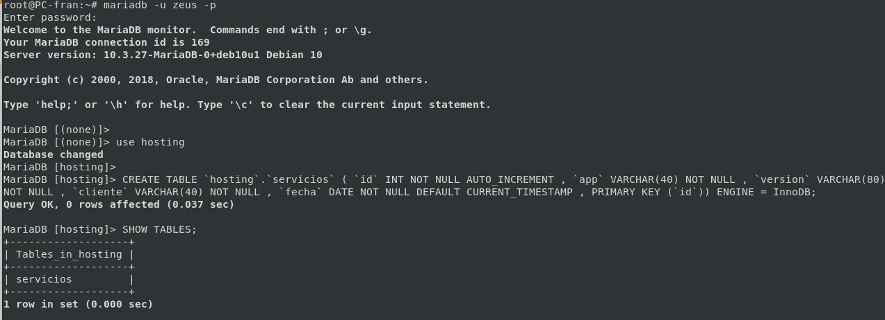
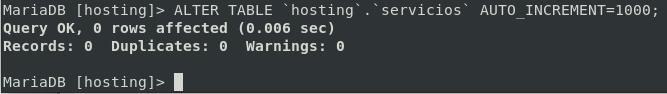

# Tablas y datos

## Tablas

<!-- ```sql
CREATE TABLE `hosting`.`servicios` ( `id` INT NOT NULL AUTO_INCREMENT , `app` INT NOT NULL , `cliente` INT NOT NULL , `fecha` DATE NOT NULL DEFAULT CURRENT_TIMESTAMP , PRIMARY KEY (`id`)) ENGINE = InnoDB;
``` -->

```sql
CREATE TABLE `hosting`.`servicios` ( `id` INT NOT NULL AUTO_INCREMENT , `app` VARCHAR(40) NOT NULL , `version` VARCHAR(80) NOT NULL , `cliente` VARCHAR(40) NOT NULL , `fecha` DATETIME NOT NULL DEFAULT CURRENT_TIMESTAMP , PRIMARY KEY (`id`)) ENGINE = InnoDB;
```
[¿InnoDB ó MyISAM?](https://www.arsys.es/blog/programacion/bases-de-datos/myisam-o-innodb-elige-tu-motor-de-almacenamiento-mysql/)



### Modificacion del valor de Auto-incremento

```sql
ALTER TABLE `hosting`.`servicios` AUTO_INCREMENT=1000;
```



## Los datos

Esta tabla contendrá los datos de aquellos servicios que despleguemos en el hosting, cuando vayamos a desplegar un servicio a través del interfaz web de la OA, este se registrara en la base de datos, y estos datos son los que se usarán para el despliegue del servicio con Kubernetes. 

Es importante tener registrados los datos de los servicios que tengamos de los clientes, ya que las tecnologías de microservicios genera una gran cantidad de entidades que después tendremos que encontrar e identificar y puede dar lugar a tener que buscar entre millares de servicios. Por ello mantendremos registrado estos en la base de datos.

Para insertar estos datos haremos uso formularios web con PHP.

Ver Formularios