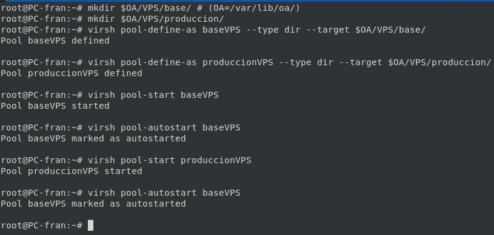
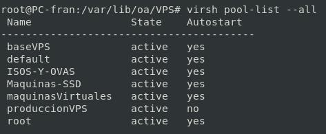

# Pools para los VPS
## Definir Pools.

```bash
mkdir $OA/VPS/base/ # (OA=/var/lib/oa/)
mkdir $OA/VPS/produccion/
virsh pool-define-as baseVPS --type dir --target $OA/VPS/base/
virsh pool-define-as produccionVPS --type dir --target $OA/VPS/produccion/
```

## Activación y Arranque.

```bash
virsh pool-start baseVPS
virsh pool-autostart baseVPS
virsh pool-start produccionVPS 
virsh pool-autostart baseVPS
```


## Pools
```bash
virsh pool-list --all
```

