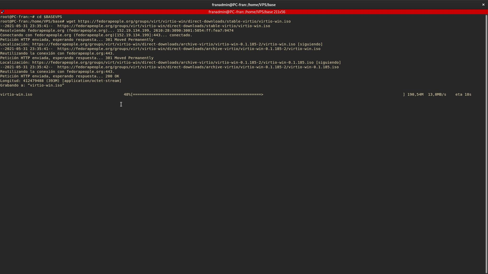
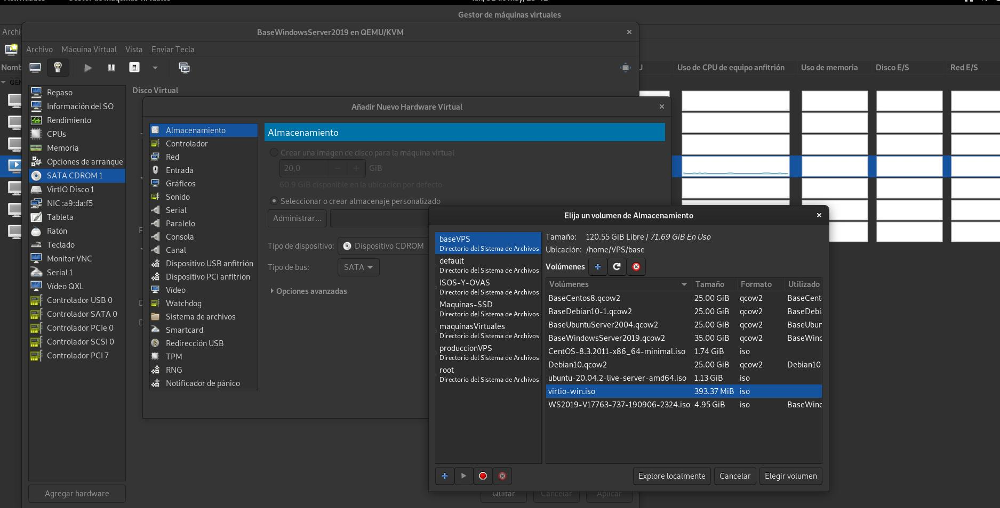
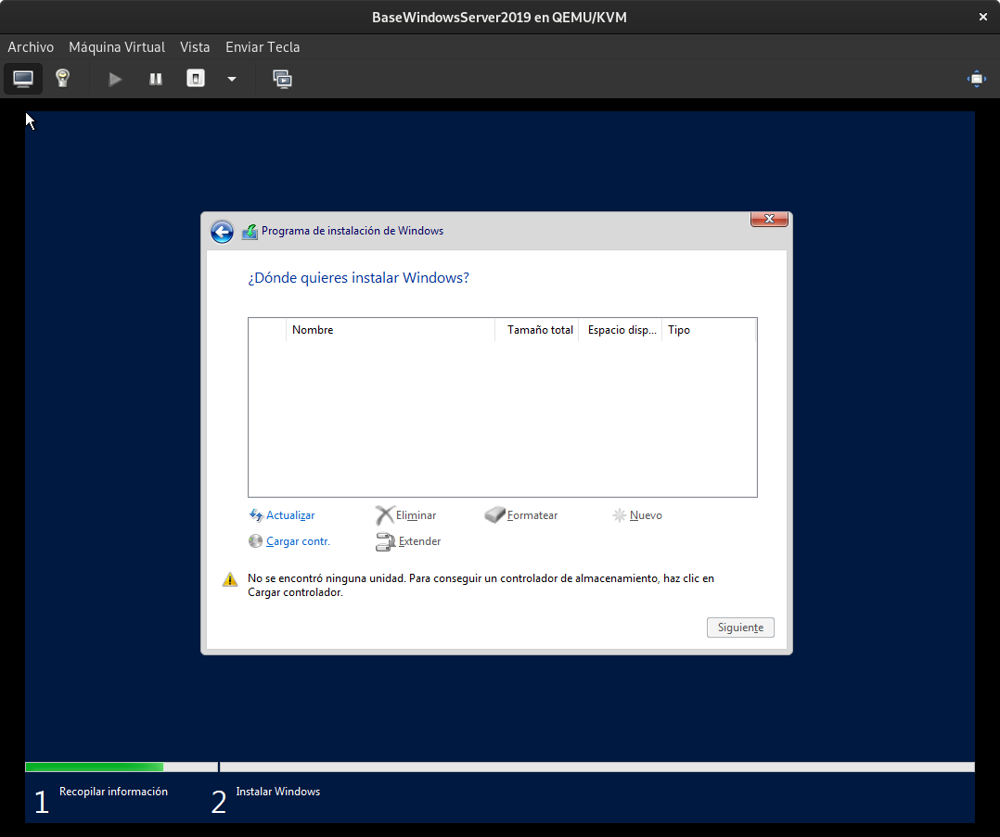
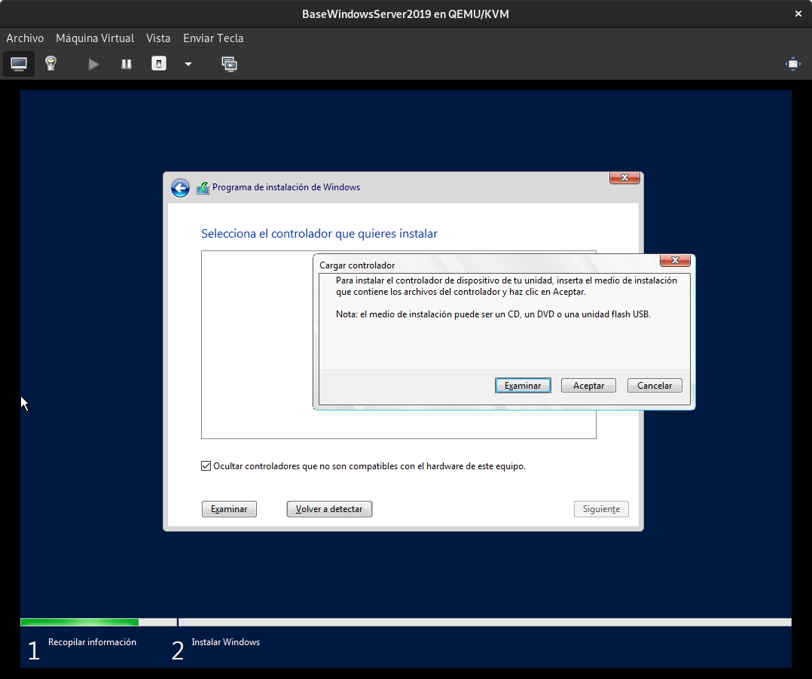
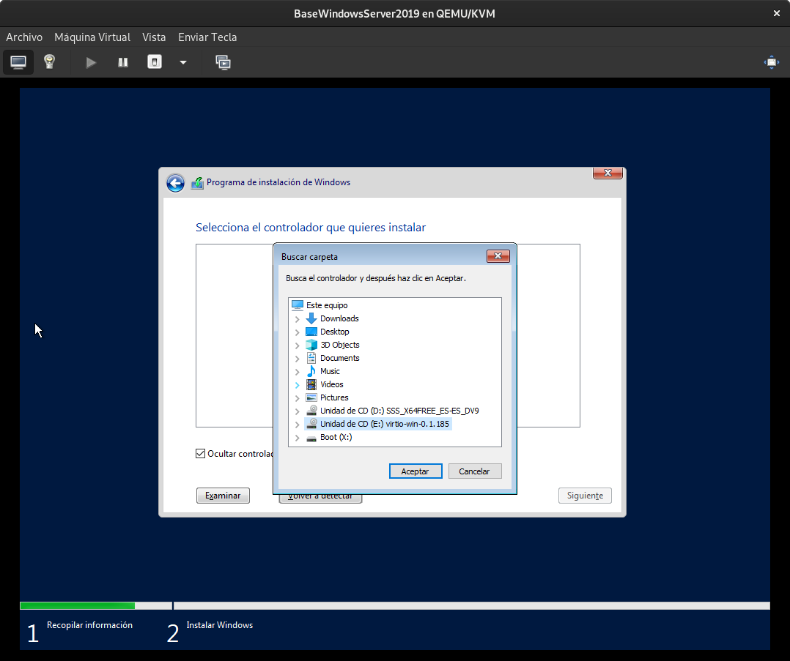
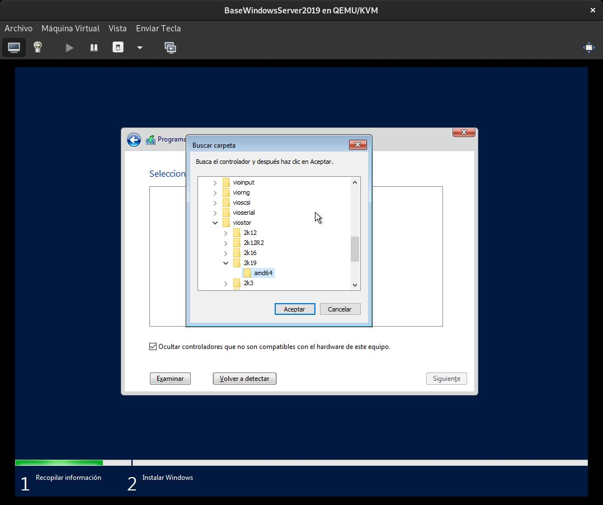
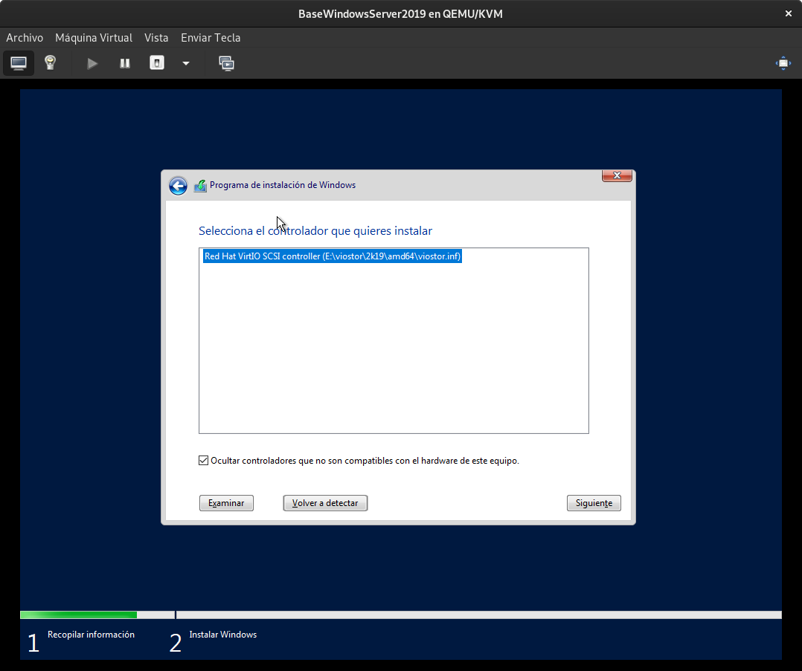
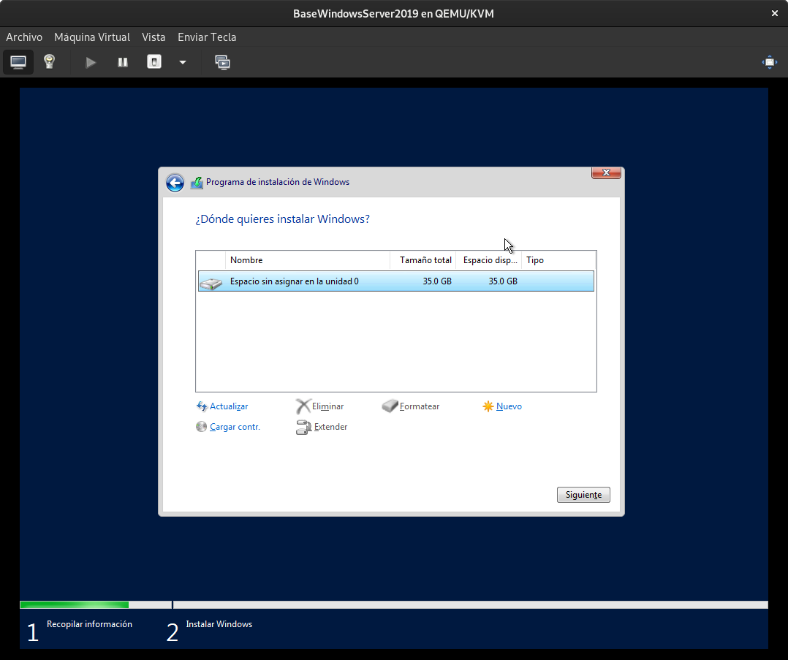

# Debian 10 (Buster) Base
Esta maquina será la que sirva de base para la creacion de servidores virtuales que sean Debian 10
## Implementación e Instalación
# Version Simple

```bash
virt-install --name vm-test \
--virt-type kvm --hvm --os-variant=debian10 \
--memory 2048 --vcpus 2 --network network=default \
--graphics vnc,password=contrasena,listen=0.0.0.0 \
--disk pool=default,size=20,bus=virtio,format=qcow2 \
--cdrom /var/lib/libvirt/images/debian-10.1.0-amd64-xfce-CD-1.iso  \
--noautoconsole \
--boot cdrom,hd
```

# Version base Cloud

```bash
nombreMaquina=PruebaBaseCloud
virt-install \
--name $nombreMaquina \
--disk pool=default,size=20,bus=virtio,format=qcow2 \
--vcpus 1 \
--ram 1024 \
--os-type linux \
--os-variant debian10 \
--network bridge=br0 \
--graphics vnc,password=contrasena,listen=0.0.0.0 \
--noautoconsole \
--location 'http://ftp.us.debian.org/debian/dists/stable/main/installer-amd64/'
```

# Version Final

```bash
virt-install --name BaseDebian10 \
--virt-type kvm \
--hvm \
--os-variant=centos7.0 \
--memory 2048 \
--vcpus 1 \
--network network=default \
--graphics vnc,password=Coria21,listen=0.0.0.0 \
--disk pool=baseVPS,size=25,bus=virtio,format=qcow2 \
--noautoconsole \
--location 'https://ftp.cica.es/CentOS/8.3.2011/isos/x86_64/CentOS-8.3.2011-x86_64-minimal.iso'
```

# Version Basica

```bash

```

# VERSION F
```bash
virt-install --connect=qemu:///system --name=Windows10prueba --ram=20148 --vcpus=1 --check-cpu --os-type=windows --hvm --vnc --accelerate --disk=/home/discosKVM/win10.img,size=32,sparse=true --cdrom=/home/administrador/windows10.iso --network=bridge:br0
```

```bash
virt-install --vnc --accelerate --disk=/home/discosKVM/win10.img,size=32,sparse=true --cdrom=/home/administrador/windows10.iso --network=bridge:br0
```

# Version Estable
```bash
virt-install --name=BaseWindowsServer2019 \
--ram=8096 \
--cpu host \
--hvm \
--vcpus=2 \
--os-type=windows \
--os-variant=win2k16 \
--disk $BASEVPS/BaseWindowsServer2019.qcow2,size=35,bus=virtio \
--cdrom $BASEVPS/WS2019-V17763-737-190906-2324.iso \
--disk $BASEVPS/WS2019-V17763-737-190906-2324.iso,device=cdrom \
--network network=default \
--graphics vnc,password=Coria21,listen=0.0.0.0 \
--noautoconsole \
--check all=off \
--boot cdrom
```
# --disk /var/lib/libvirt/boot/WS2019-V17763-737-190906-2324.iso,device=cdrom \

```bash
cd $BASEVPS
wget https://fedorapeople.org/groups/virt/virtio-win/direct-downloads/stable-virtio/virtio-win.iso
# wget https://fedorapeople.org/groups/virt/virtio-win/direct-downloads/latest-virtio/virtio-win.iso
```












Para añadirlo directamente en el script de creacion de VPS BASE:

# Version Estable V2
```bash
virt-install --name=BaseWindowsServer2019 \
--ram=8096 \
--cpu host \
--hvm \
--vcpus=2 \
--os-type=windows \
--os-variant=win2k16 \
--disk $BASEVPS/BaseWindowsServer2019.qcow2,size=35,bus=virtio \
--cdrom $BASEVPS/WS2019-V17763-737-190906-2324.iso \
--disk $BASEVPS/WS2019-V17763-737-190906-2324.iso,device=cdrom \
--network network=default \
--graphics vnc,password=Coria21,listen=0.0.0.0 \
--noautoconsole \
--check all=off \
--boot cdrom
```

<!-- --cpu host
Expose the nearest host CPU model configuration to the guest.  It is the best CPU which can be used for a guest on any of the hosts. -->


# VERSION NO ESTABLE
```bash
virt-install --name=W2K19 --ram=2048 --cpu host --hvm --vcpus=2 --os-type=windows --os-variant=win10 --disk /var/lib/libvirt/images/W2K19.img,size=40,bus=virtio --disk /var/lib/libvirt/boot/17763.737.190906-2324.rs5_release_svc_refresh_SERVER_EVAL_x64FRE_en-us_1.iso,device=cdrom,bus=ide --disk /var/lib/libvirt/boot/virtio-win-0.1.171.iso,device=cdrom,bus=ide --network bridge=br0 --graphics vnc,listen=0.0.0.0,port=5904 --check all=off
```
