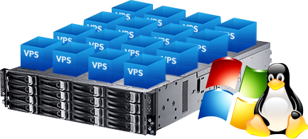

# Arquitectura de Orquestacion para Hosting (OA)

## Descripción del proyecto.📣

En este proyecto he desarrollado una pequeña arquitectura que he autodenominado la OA (Orchestration Area) que permite la automatización y despliegue de Servicios y Maquinas Virtuales (VPS), semejantes a las cuales ofrecería un hosting.

El enfoque del proyecto esta en el despliegue automatizado y el bajo impacto computacionalmente hablando en lo que sería los servidores del hosting, es decir, que el consumo de recursos de los servicios y vps ofrecidos sean poco pesados.

Podemos diferenciar los ""productos"" que podríamos desplegar con la OA en 2 grandes tipos:

- ***Servicios***: Serán aquellos CMS mas usados a día de hoy; *Wordpress, Joomla, PrestaShop...* Estos Servicios estarán **contenerizados** en un cluster utilizando la tecnología de **Docker** y Orquestados por la tecnología de **Kubernetes**, ambas tecnologías pertenecen a una comunidad **Open Source**. Al tener los servicios contenerizados conseguimos unas **Pérdidas por virtualización mínimas**, ya que no virtualizamos un sistema operativo completo por cada servicio; ***aislamiento, seguridad, escalabilidad de los servicios*** y por ultimo pero no menos importante nos brinda la posibilidad de automatizar el despliegue de los servicios.

- ***VPS***: En el caso de **VPS** serán máquinas virtuales completas, estás pueden ser **desplegadas** con una configuración estándar: (Entorno **LAMP,LEMP,Docker,Etc).**
Para los VPS se levantarán maquinas utilizando un **hipervisor de Tipo 1** como es **KVM**, (Máquina Virtual Basada en Kernel): KVM está integrado en el Kernel de Linux.Permite convertir el kernel de Linux en un hipervisor. permitiendo crear maquinas virutales con **mínimas perdidas** posibles dando **acceso directo al hardware** consiguiendo un **rendimiento casi bare-metal**. KVM es un hipervisor que pertenece a una comunidad **Open Source**, lo que lo convierte en una opción ideal para mi entorno. Estas máquinas virtuales serán orquestadas por **Ansible** para aquellas tareas administrativas que se le realicen a los VPS antes de su entrega.

El objetivo es que el despliegue este automatizado y gestionado gracias a la OA y sus componentes en la cual trabajar principalmente.

## [Introducción teórica.📖](hojas/introTeorica.md)
## [Configuración de la red (Mapa de red).🔌](hojas/ConfiguracionDeLaRed.md)
## [Herramietas y tecnologías utilizadas.🛠️👨‍💻](hojas/tecnologias.md)
## [Desarrollo del proyecto con detalle. 📝](hojas/desarolloProyecto/README.md)
## [Conclusiones y dificultades encontradas en el proyecto.💭](hojas/concluYdificultades.md)
## [Referencias utilizadas.🔍](hojas/referencias.md)
