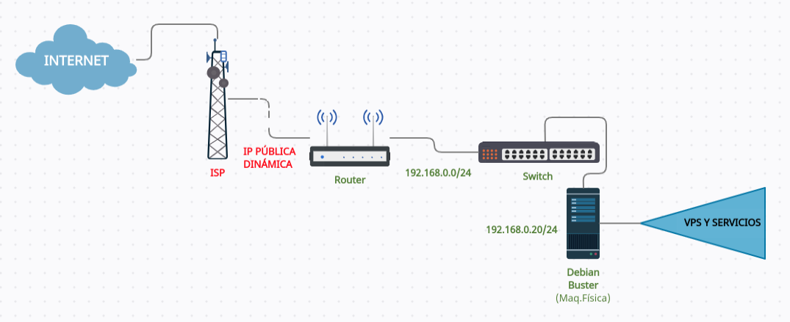

# Configuración de la red (Mapa de red).🔌

Este proyecto trabajaré con mi PC Debian 10 como sistema operativo físico o anfitrión, actualmente la tengo conectada a un switch que su vez, este esta conectada directamente al router de mi ISP. Dentro de mi máquina estará el cluster virtual para los contenedores (minikube en mi caso por la infraestructura de la que dispongo) y los Maquinas Virtuales ó VPS.

> Tengo realizada una reserva DHCP en mi router con la IP 192.168.0.20 para mi maquina física cuanto a la IP pública de la que dispongo es cambiante ya que no tengo contratado ninguna reserva de IP con mi ISP.

## Mapa de Red

