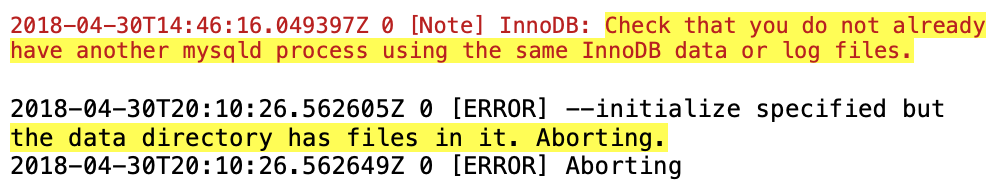
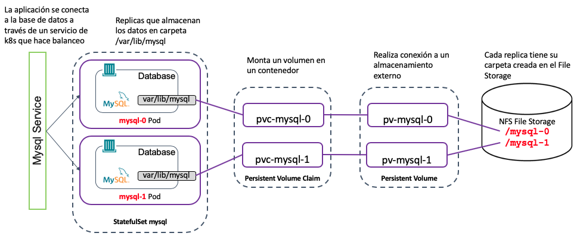
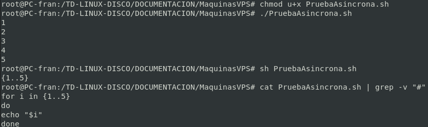
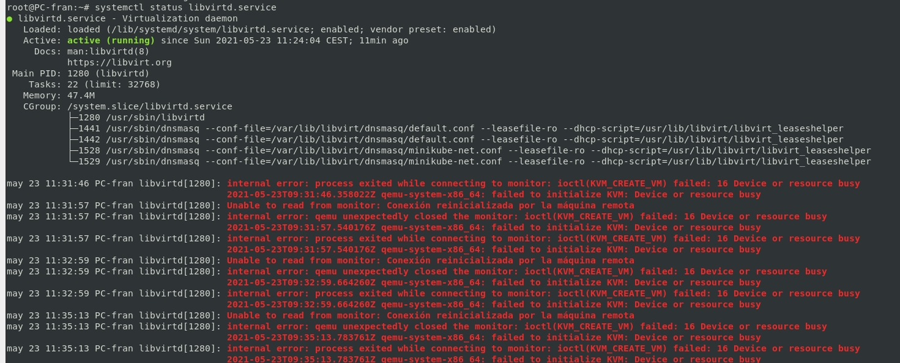

# Algunas de las dificultas más destacables

## Bases de datos y replicas de PODs

Las bases de datos no pueden ser replicadas ya que dos MySQL no pueden compartir el mismo directorio de /var/lib/mysql, para ello es necesario crear un cluster de MySQL con una herramienta que nos proporciona Docker la cual permite tener distintas base de datos de distintos servicios en mysql. Ejecutada en un cluster de pods. (En mi caso por la interoperabilidad que necesito prefiero mantener fuera de un mismo cluster base de datos de distintos clientes)

Si nos adrentramos en uno de los POD de MySQL nos encontramos un fallo como este:

## Solución:

Crear un cluster de MySQL con Percona un software ofrecido por Docker.

Esta sería la arquitectura según Perdona:

## Diferencias de interpretación entre sh y bash

Hay una clara diferencia entre la bash actual y el sh utiliza linux. En el siguiente ejemplo simple se aprecia como entiende el script de 2 manera distintas bash y sh.

## KVM y VirtualBox

De la misma forma que Hyper-V y VirtualBox no son compatibles. KVM-QEMU no es compatible hay que parar el procesos de virtualbox en caso de dejar alguno abierto en segundo plano:

