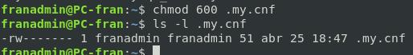

# Configuraciones de MariaDB 📖

## Configuracion del fichero my.cnf

Durante la ejecución de scripts haremos consultas SQL desde la bash, para evitar tener que indicar la contraseña manualmente durante la ejecución de scripts haremos uso de este fichero.

> Jámas se debe permitir que un usuario pueda acceder sin contraseña, **NO CONFUNDIR** esta propiedad de MariaDB que permite almacenar las credenciales en un fichero de configuración a permitir realizar ***conexiones sin contraseña a usuarios*** cambiando la propiedad: `AllowNoPassword`.

***Destacar ademas que el usuario configurado es un usuario de solo lectura en MariaDB solo puede ejecutar sentencias SELECT***

### Sintaxis del fichero:

```conf
[client] 
host=localhost
user=thor
password=Coria21
```


### Seguridad del Fichero (Permisos)

> Unicamente puede ser visto por el usuario de la OA que ejecutará los scripts.




________________________________________
*[Volver al atrás...](./README.md)*