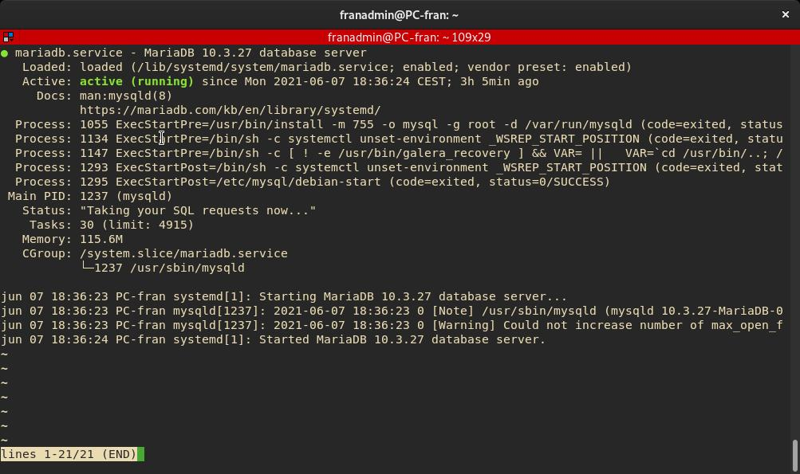

# Reinstalación y borrado completo de MariaDB-MySQL.📖 

## MariaDB

```bash
systemctl stop mariadb
apt-get remove --purge mariadb* # ELIMINAR COMPLETAMENTE PAQUETE
apt-get autoremove # ELIMINAR COMPLETAMENTE PAQUETE
apt-get autoclean # ELIMINAR COMPLETAMENTE PAQUETE
rm -rf /etc/mysql # BORRAR configuraciones
rm -rf /var/lib/mysql* # BORRAR Bases de datos
apt install -y mariadb-server # Instalacion MariaDB
```

## MySQL

```bash
/etc/init.d/mysql stop
apt-get remove --purge mysql* #ELIMINAR COMPLETAMENTE PAQUETE
apt-get autoremove # ELIMINAR COMPLETAMENTE PAQUETE
apt-get autoclean # ELIMINAR COMPLETAMENTE PAQUETE
rm -rf /etc/mysql # BORRAR configuraciones
rm -rf /var/lib/mysql* # BORRAR Bases de datos
apt install -y mariadb-server # Instalacion MariaDB
```

## Comprobar Servicio

```bash
systemctl status mariadb
```



________________________________________
*[Volver al atrás...](./README.md)*