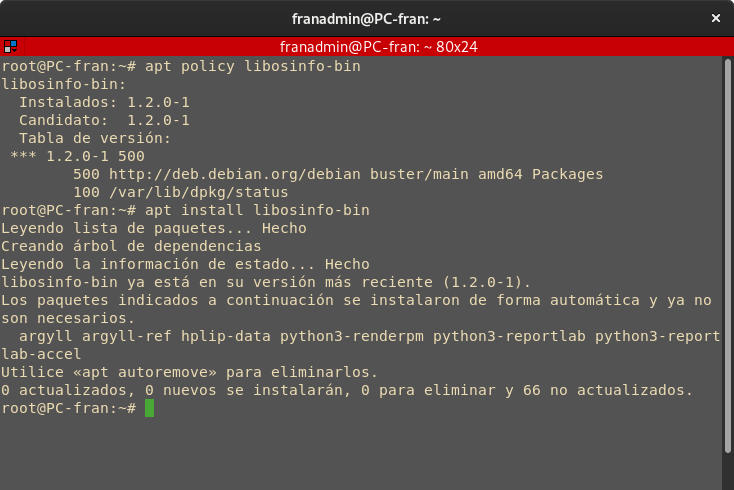
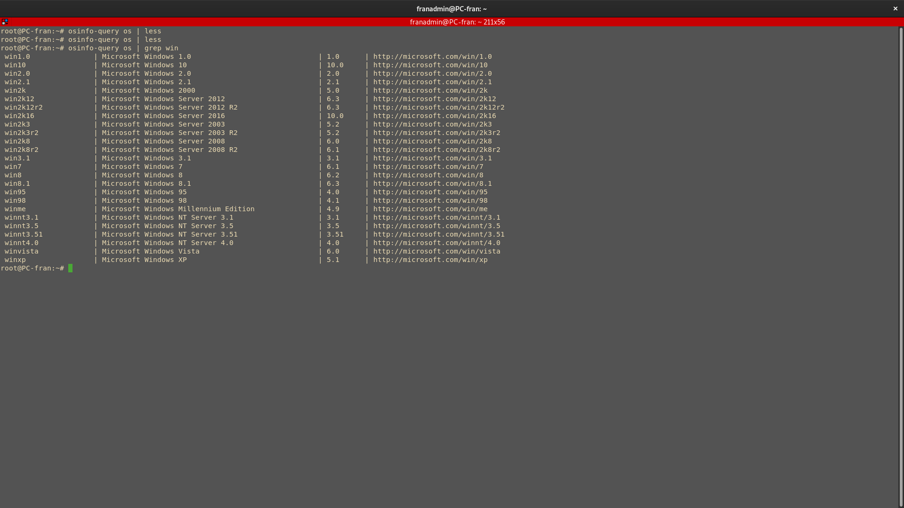
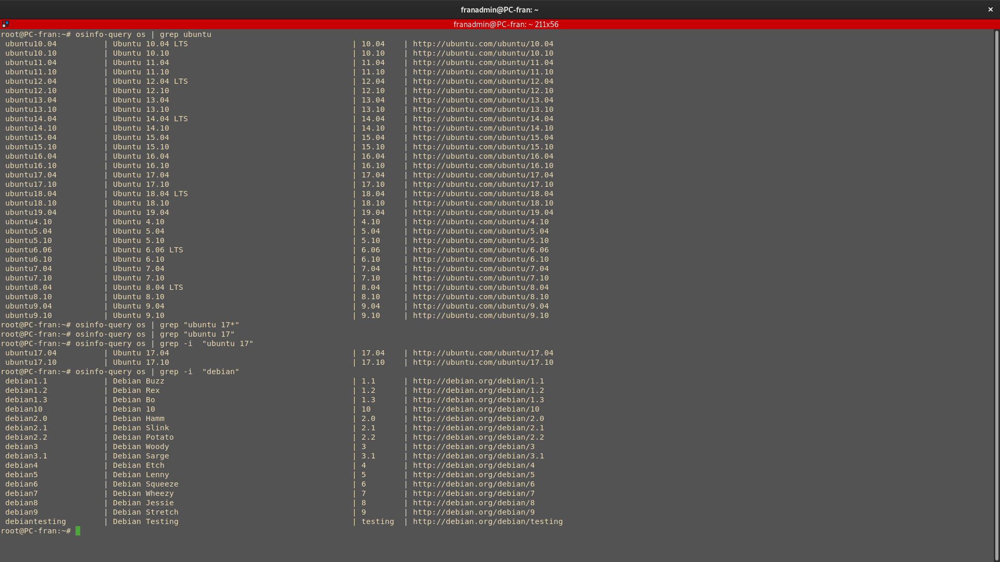

# Explicación Parámetros KVM

## Controladores Virtio
> Los controladores VirtIO son los mas eficientes:

Los controladores Virtio aumentan el rendimiento de las máquinas invitadas. Con los controladores Virtio la latencia de E/S disminuye enormemente consiguiendo un rendimiento a niveles a casi bare-metal. Es recomendable utilizar controladores virtio con KVM-Qemu para aumentar así el rendimiento.

_Bare-Metal signfica que su rendimiento es prácticamente idéntico que el de la máquina anfitriona_

## Virt-install

- ***`--virt-type kvm`***: KVM gestiona las máquinas virtuales de diferentes tipos, especificamos aquí que queremos usar kvm. 
- ***`--hvm`***: Ej: _--hvm --os-variant=ubuntu20.04_ permite usar toda la funcionalidad del hipervisor para optizarlo al sistema opertivo indicado. 
    - ***`--os-variant`***: habilitar optimización para el sistema opertivo indicado.
- ***`--ram 1024 -vcpus 2 --network network=default`***: Configuración de CPU, RAM, red…
- ***`--graphics vnc,password=Coria21,listen=0.0.0.0`***: En este caso he configurado una contraseña para acceder a la “consola gráfica” de la máquina, la conexión se realiza por VNC. Virt-viewer y virt-manager pedirá la contraseña antes de conectarse.
- ***`--disk pool=default,size=20,bus=virtio,format=qcow2`***: Disco para la Maquina Virtual, pool de almacenamiento, tamaño, tipo de bus y formato de disco. 
- ***`--cdrom "$BASEVPS/ubuntu-20.04.2-live-server-amd64.iso"`***:  Apunta a la ISO de instalación.
- ***`--noautoconsole`***: Al crear la máquina, KVM lanza de manera automáticamente la consola. este parámetro lo impide.
- ***`--boot cdrom,hd`***: Orden de de arranque.

## Tipo de Sistema Operativo KVM

Para poder virtualizar de manera eficente una Máquina lo ideal es indicar virtualizacion del tipo KVM e indicar el os-variant, lo que se traduce como tipo de sistema opertivo. Para ver los tipos de sistemas opertivos soportados ademas de información intersante como podría ser ubicaiones de ISOS de estos tenemos que instalar el siguiente paquete:

```bash
apt install libosinfo-bin
```



### Todos los Sistemas Operativos Disponibles

```bash
osinfo-query os | less
```


### Para Windows

```bash
osinfo-query os | grep -i "win"
```



### Para Ubuntu,Debian,...

```bash
osinfo-query os | grep -i "TipoDeSistema"
```



________________________________________
*[Volver al atrás...](./kvmQemu.md)*
