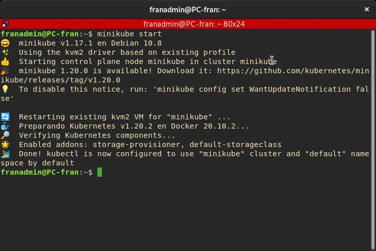
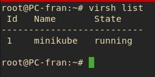
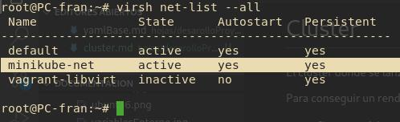
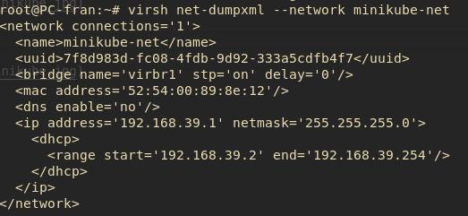
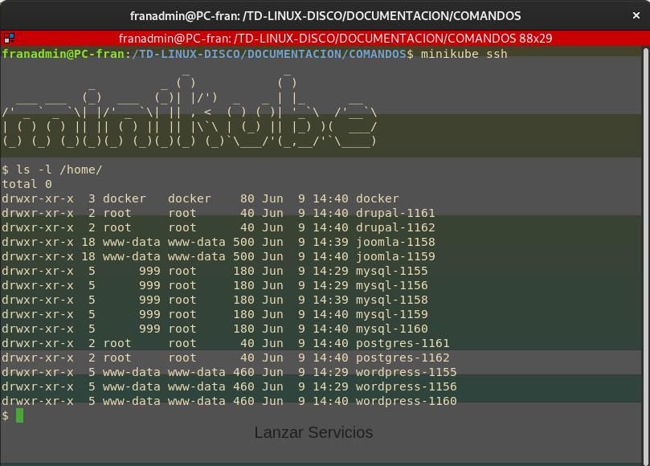
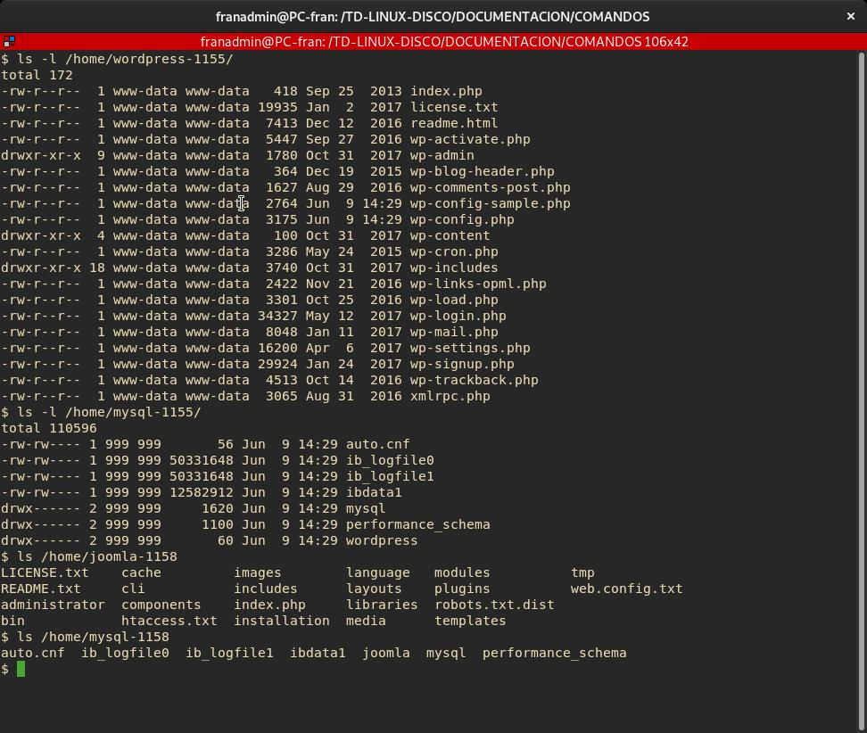

# Cluster

El cluster donde se lanzarán los servicios esta creado con la tecnología de Minikube, por cuestiones de infraestructura de la que dispongo esta a sido me elección.

Para conseguir un rendimiento eficiente el cluster se monta en KVM en vez de VirtualBox que es la configuración estadar.

## Configuración de hipervisor

```bash
minikube config set driver kvm2
```

## Máquina minikube libvirt

Para crear el cluster:

```bash
minikube start
```




## Red libvirt




## Servicios en Producción en el cluster

En cada una de las carpetas que se encuentran en `/home` están los servicios de los clientes con la siguiente estructura: `cliente-IdentificadorUnico`



## Ejemplos de contenido en `/home/ElServicio` en el cluster

