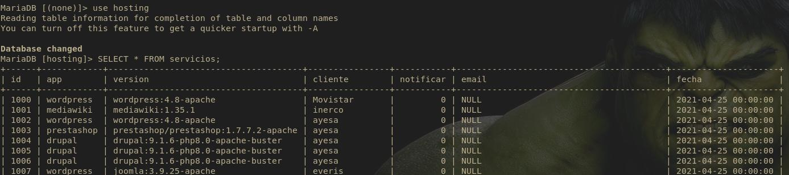
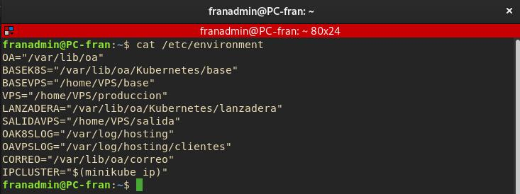

# Kubernetes y Docker

## Servicios

Los Servicios son contenerizados con docker, estos contenedores no los creamos directamente en docker sinó que utilizamos Kuberentes como orquetador de contenedores. Para crear y lanzar los diferentes servicios al cluster. (volumenes, redes, contenedores, etc). La OA indicará a Kubernetes las caracteristicas de los contenedores que necesitamos lanzar según hayán sido resgistrado en la base de datos a traves de ficheros YAML y será Kubernetes en base a estos ficheros YAML el que los cree en docker, con las caracteristicas indicadas y de manera desatendida para nosotros.

Con el uso de Kubernetes conseguimos: Facilidades para el despliegue, Escalabilidad y balanceo de carga, Aislamiento de procesos y aplicaciones, Optimización de recursos automáticos, Alta disponibilidad...

Existe una seríe de ficheros YAML base, que la OA personalizará en cada lanzamiento a partir de aquellos paŕametros indicados en la base de datos `hosting` en concreto la tabla `servicios` y algún otro parámetro generado por la OA. _ver punto scripting_



Una vez lanzado el servicio al cluster se enviará un email al cliente indicado en la base de datos bajo el dominio topserver@gmail.com _Ver Configuración correo_

**Variables de entorno que debemos conocer de los servicios:**

```bash
cat /etc/environment
```




```conf
OA="/var/lib/oa"  # Directorio raíz de la OA
BASEK8S="/var/lib/oa/Kubernetes/base" # Almacen de ficheros YAML Base para generar nuevos servicios 
LANZADERA="/var/lib/oa/Kubernetes/lanzadera" # "Lanzadera" donde estarán los ficheros YAML ya personalizados por la OA que se lanzan al cluster
OAK8SLOG="/var/log/hosting"  # Logs de proceso de personalizacion del YAML y lanzamiento del Servicio
CORREO="/var/lib/oa/correo" # Almacen de mensajes de correos de Serivios y VPS
IPCLUSTER="$(minikube ip)" # IP del Cluster
```

## [YAML Base para servicios](./yamlBase/yamlBase.md)

## [Explicación Parámetros KVM](ExpliParemetros.md)

## [Pools para los VPS](pools.md)

## [Red](red.md)

________________________________________
*[Volver al atrás...](./oa.md)*
