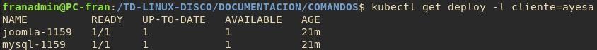
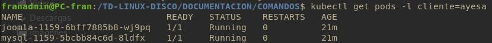
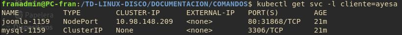
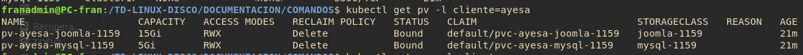
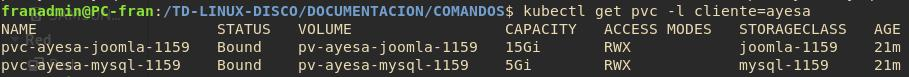

# Puntos de un Servicio en Kubernetes

Cada uno de los servicios que se desplegen en cluster tendrán cada uno de los siguientes puntos o entidades.

## Deploy

```bash
kubectl get deploy -l cliente=ayesa
```



## Pods

```bash
kubectl get pods -l cliente=ayesa
```



## Servicios

```bash
kubectl get svc -l cliente=ayesa
```



## Volumenes (pv)

```bash
kubectl get pv -l cliente=ayesa
```



## Volumenes (pvc)

```bash
kubectl get pvc -l cliente=ayesa
```

