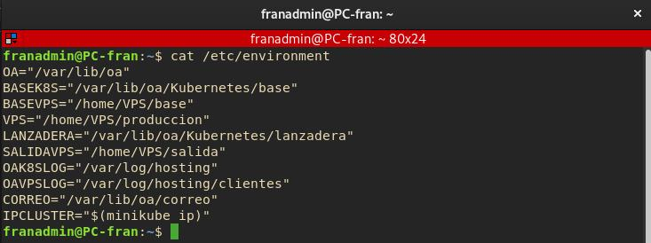

# KVM-QEMU

## VPS

Los VPS son más que Máquinas Virtuales en KVM-QEMU, estas máquinas son creadas a partir de una sería de máquinas base, esta es clonada y procesada de tal manera que sean totalmente distintas una de la otra, una vez que la máquina nueva a esta arrancada, la OA indicara a Ansible preparar la máquina con el plan VPS indicado en la base de datos (Implementar LAMP, PostgreSQL, Docker, etc).

Una vez finalizado las tareas de preparación del VPS se enviará un email al cliente indicado en la base de datos bajo el dominio topserver@gmail.com _Ver Configuración correo_

**Variables de entorno que debemos conocer de los VPS:**



```bash
cat /etc/environment
```

```conf
OA="/var/lib/oa" # Directorio raíz de la OA
BASEVPS="/home/VPS/base" # Almacen de Máquinas Base para generar nuevos VPS 
VPS="/home/VPS/produccion" # Almacen de VPS activos de los clientes
SALIDAVPS="/home/VPS/salida" # Datos de VPS que se van a lanzar próximamente
OAVPSLOG="/var/log/hosting/clientes" # Logs de proceso de salida o lanzamiento del VPS.
CORREO="/var/lib/oa/correo" # Almacen de mensajes de correos de Serivios y VPS
```
_He tenido que cambiar las rutas de los Pools de las maquinas virtuales por problemas de espacio_

Las rutas Originales son: `$OA/VPS/produccion`
Las rutas Originales son: `$OA/VPS/base`

### [Máquinas Bases](./maquinasBase/mvBase.md)

________________________________________
*[Volver al atrás...](../README.md)*