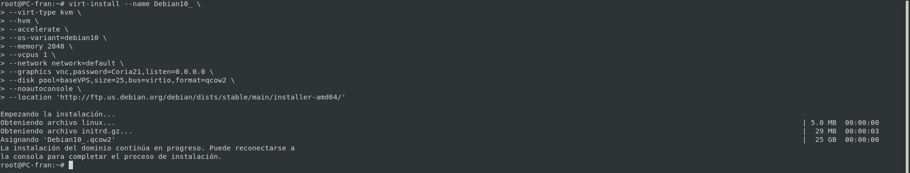
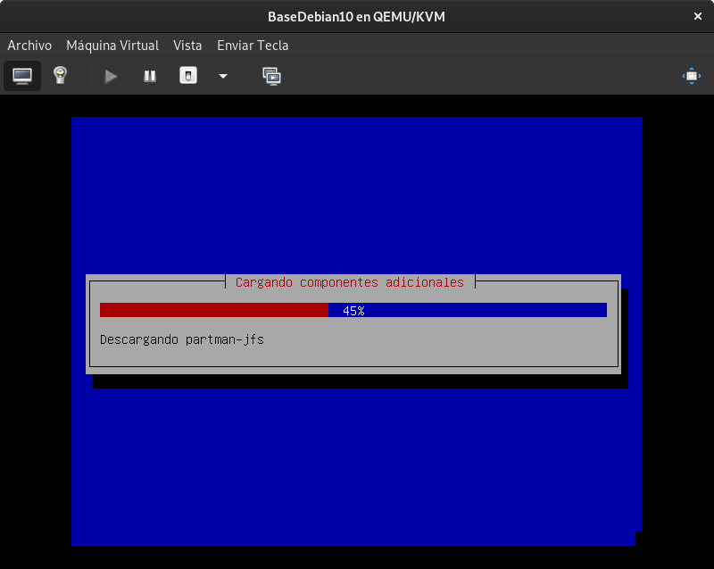
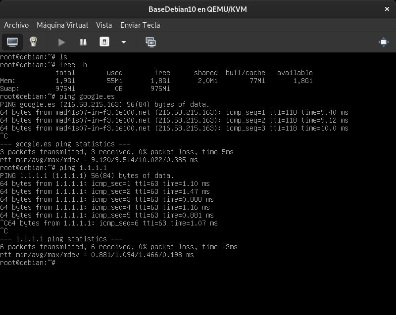

# Maquina Base Debian 10

```bash
virt-install --name Debian10 \
--virt-type kvm \
--hvm \
--accelerate \
--os-variant=debian10 \
--memory 2048 \
--vcpus 1 \
--network network=default \
--graphics vnc,password=Coria21,listen=0.0.0.0 \
--disk pool=baseVPS,size=25,bus=virtio,format=qcow2 \
--noautoconsole \
--location 'http://ftp.us.debian.org/debian/dists/stable/main/installer-amd64/'
```





________________________________________
*[Volver al atrás...](./mvBase.md)*