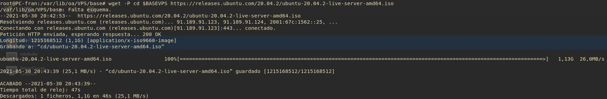
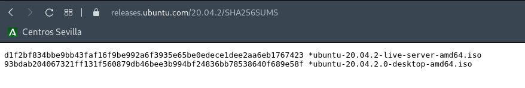
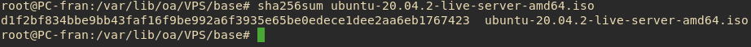
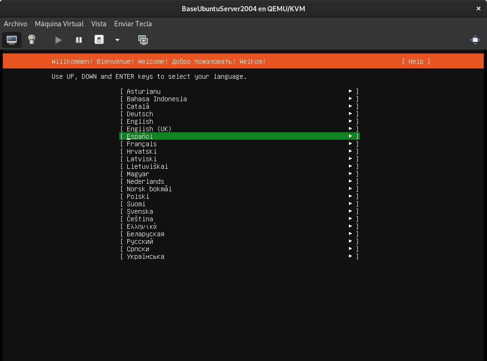
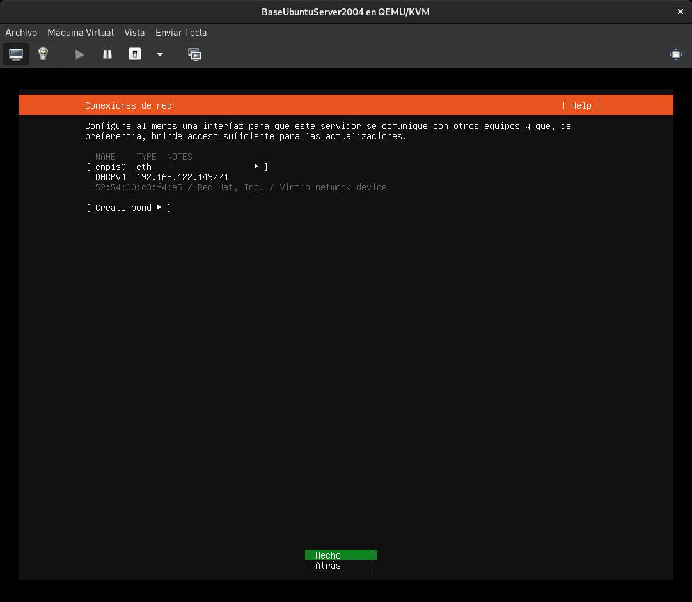
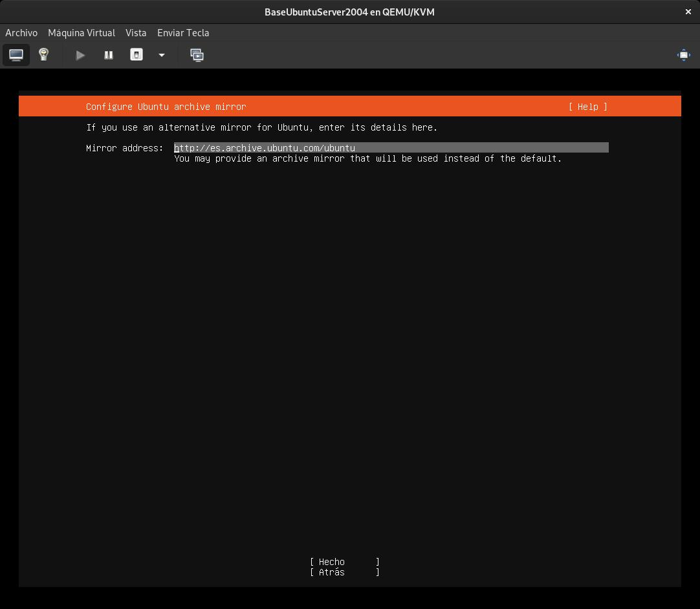
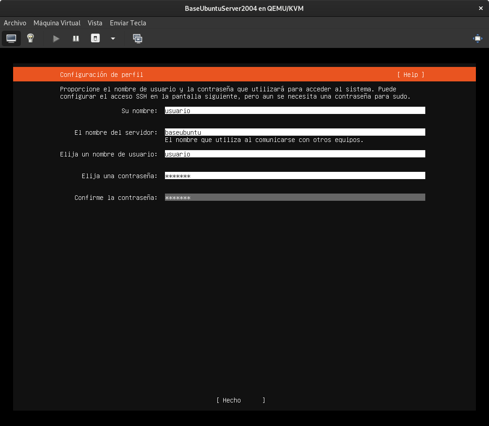
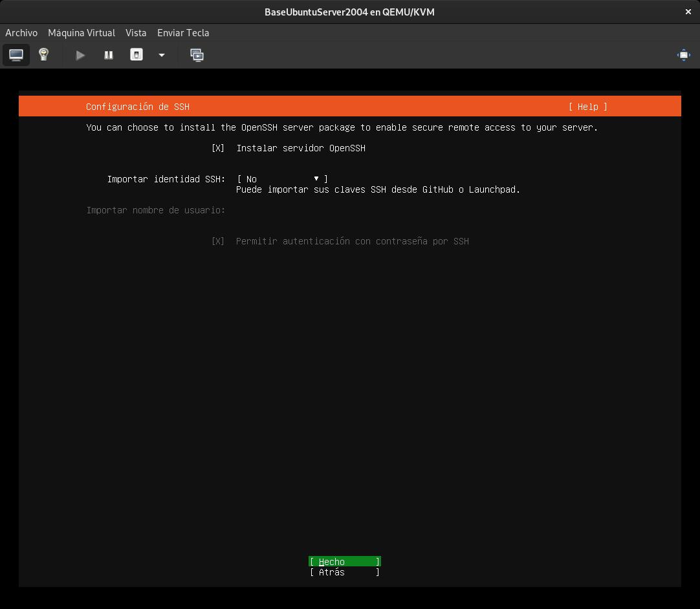
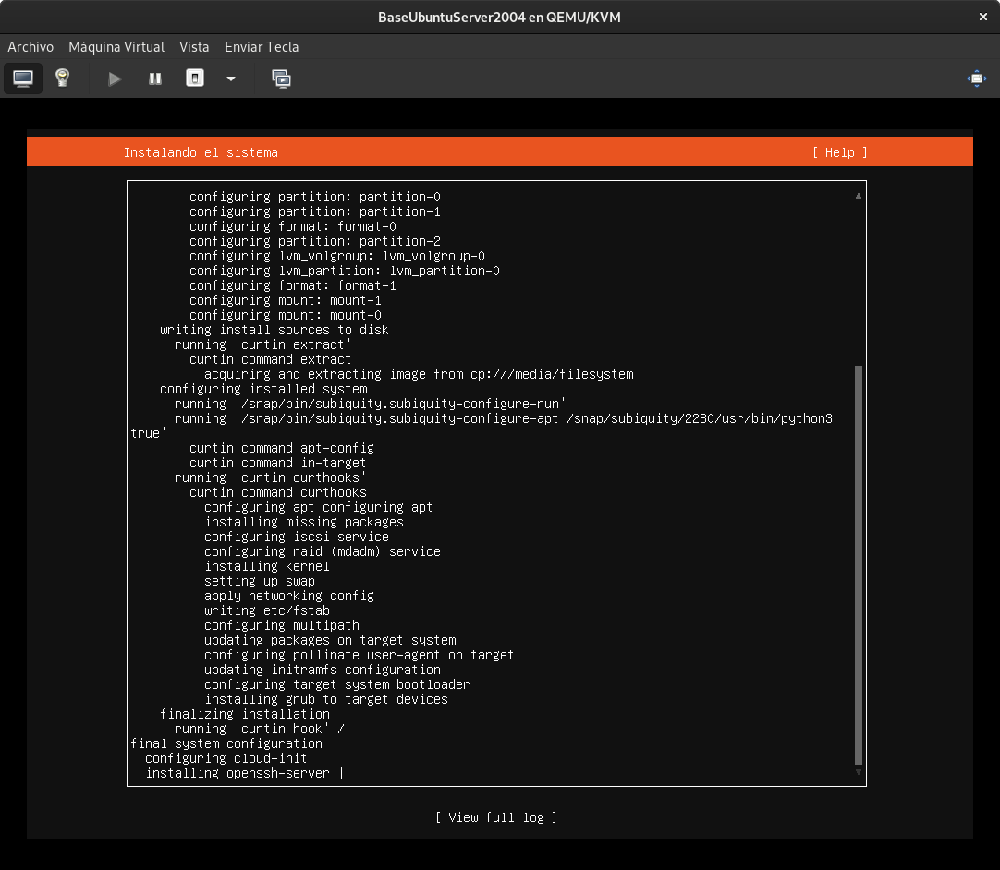
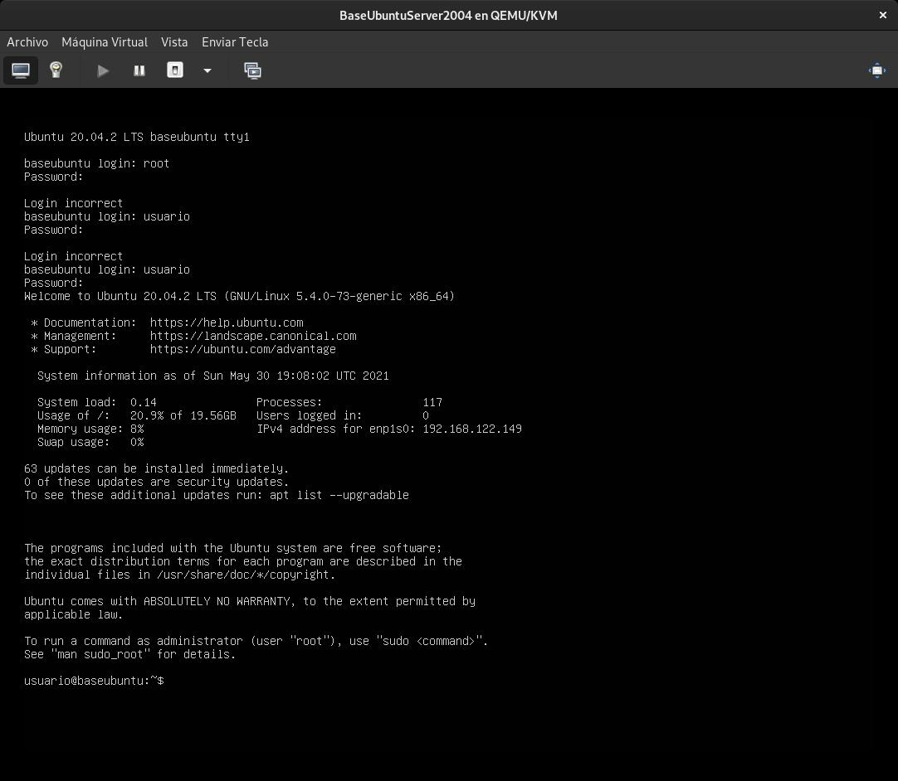

# Máquina Base Ubuntu Server 20.04

> En el caso anterior, con Debian,la creación de la maquina basee en KVM se obtiene en directo desde el repositorio oficial http://ftp.us.debian.org/ y se crea el VPS en base a la imagen expuesta en repositorio.

> En el caso de Ubuntu Server, ubuntu no tiene esta funcionalidad directa KVM por lo que es necesario descargar la ISO de su Web, moverlo al pool de KVM, y añadirlo como medio de instalación. Para comprobar la integridad de esta .ISO y asegurar que todos los VPS se creen en base a esta imagen sean seguras, utilizaremos el HASH que nos proporcian de la .ISO para asegurar la integridad de la imagen .ISO

## Obtener Imagen ISO Oficial:

```bash
wget -P $BASEVPS https://releases.ubuntu.com/20.04.2/ubuntu-20.04.2-live-server-amd64.iso
```


## Comprobar integridad de la Imagen hash

```bash
sha256sum $BASEVPS/ubuntu-20.04.2-live-server-amd64.iso
```



_Los hash son iguales por lo que la integridad de la ISO esta 100% asegurada por SHA-256_

## Crear Máquina

```bash
virt-install --name BaseUbuntuServer2004 \
--virt-type kvm \
--hvm \
--os-variant=ubuntu19.04 \
--memory 2048 \
--vcpus 1 \
--network network=default \
--graphics vnc,password=Coria21,listen=0.0.0.0 \
--disk pool=baseVPS,size=25,bus=virtio,format=qcow2 \
--cdrom "$BASEVPS/ubuntu-20.04.2-live-server-amd64.iso" \
--noautoconsole
```







