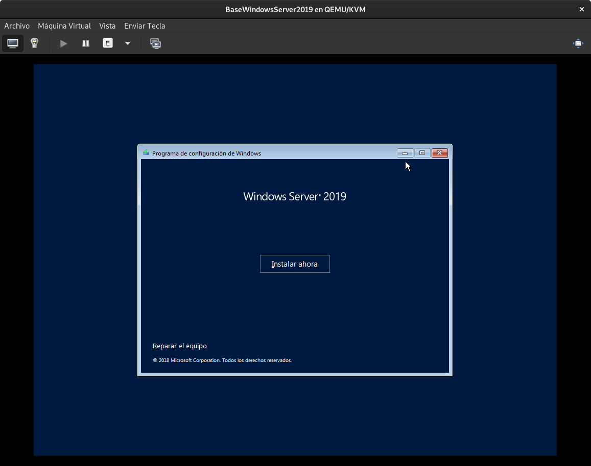
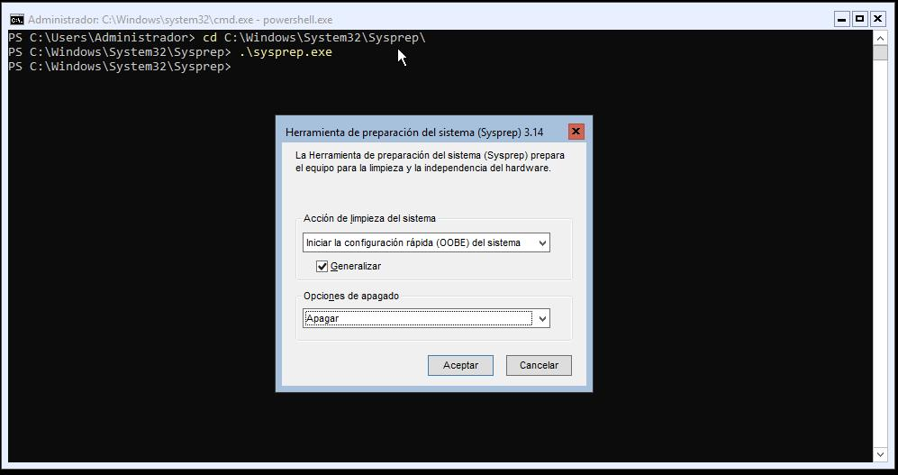
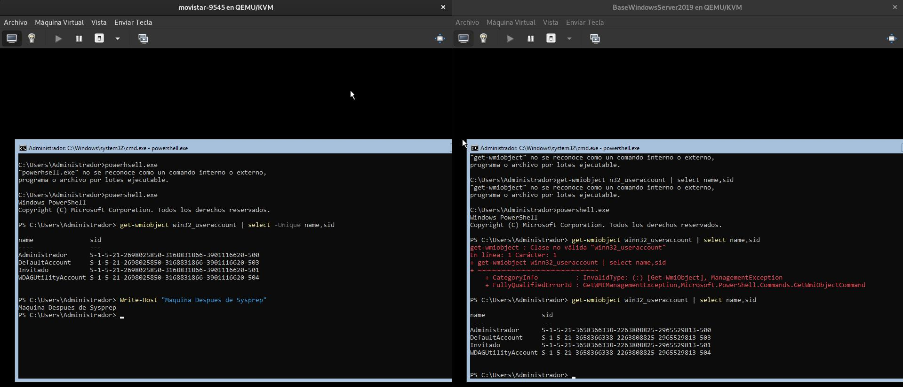
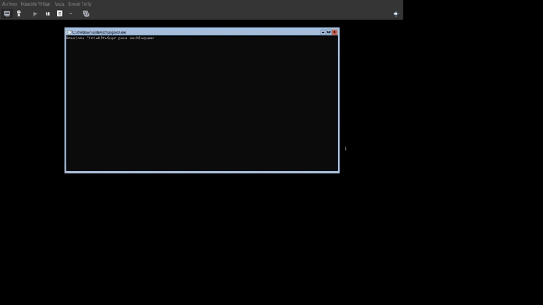

# Máquina Base Windows Server 2019
Esta máquina será la que sirva de base para la creacion de servidores virtuales que sean Windows Server 2019
## Crear Máquina

## Versión Sin Virtio

```bash
virt-install --name=BaseWindowsServer2019 \
--ram=8096 \
--cpu host \
--hvm \
--vcpus=2 \
--os-type=windows \
--os-variant=win2k16 \
--disk $BASEVPS/BaseWindowsServer2019.qcow2,size=35,bus=virtio \
--cdrom $BASEVPS/WS2019-V17763-737-190906-2324.iso \
--disk $BASEVPS/WS2019-V17763-737-190906-2324.iso,device=cdrom \
--network network=default \
--graphics vnc,password=Coria21,listen=0.0.0.0 \
--noautoconsole \
--check all=off \
--boot cdrom
```

## Versión Con Virtio

### Descarga de Drivers para la controladora Virtio

```bash
wget -P $BASEVPS https://fedorapeople.org/groups/virt/virtio-win/direct-downloads/stable-virtio/virtio-win.iso
```

```bash
virt-install --name=BaseWindowsServer2019 \
--ram=8096 \
--cpu host \
--hvm \
--vcpus=2 \
--os-type=windows \
--os-variant=win2k16 \
--disk $BASEVPS/BaseWindowsServer2019.qcow2,size=35,bus=virtio \
--cdrom $BASEVPS/WS2019-V17763-737-190906-2324.iso \
--disk $BASEVPS/WS2019-V17763-737-190906-2324.iso,device=cdrom \
--network network=default \
--graphics vnc,password=Coria21,listen=0.0.0.0 \
--noautoconsole \
--check all=off \
--boot cdrom
```


## Añadir Virtio e instalación de WS2019





> **Añadir el virtio-win.iso como CD-ROM en Virt-Manager**


> **Añadir el 2K19 Es la version para Windows Server 2019 y amd64 la opción de 64 bits**


### _Gracias al driver añadido Windows tiene los drivers para la controlara virtual virtio y puede reconocer los discos_


## CONFIGURACIONES PARA VPS BASE WINDOWS SERVER 2019
### SSH
**Comprobar si se encuentra habilitada SSH**

**Habilitar SSH**


**Conexion SSH Local**

**Conexion SSH desde Debian 10 a Windows Server 2019**


## Preparación de máquina para clonados **_Ver punto de Windows en Scripting OA_**

```ps1
powershell.exe
cd C:\Windows\System32\Sysprep
.\Sysprep.exe
```



## Probar Sysprep

### SID de usuarios son diferentes entre máquinas



### Al arrancar el VPS

Al arrancar el VPS se puede apreciar como pide las credenciales administativas y se configura como si de una máquina nueva se tratase




________________________________________
*[Volver al atrás...](./mvBase.md)*