# Máquina Base Centos 8

> En el caso anterior, con Debian,la creación de la maquina basee en KVM se obtiene en directo desde el repositorio oficial http://ftp.us.debian.org/ y se crea el VPS en base a la imagen expuesta en repositorio.

> En el caso de Centos 8, no tiene esta funcionalidad directa KVM por lo que es necesario descargar la ISO desde un Mirror, moverlo al pool de KVM, y añadirlo como medio de instalación. Para comprobar la integridad de esta .ISO y asegurar que todos los VPS se creen en base a esta imagen sean seguras, utilizaremos el HASH que nos proporcian de la .ISO para asegurar la integridad de la imagen .ISO

## Obtener Imagen ISO Oficial:

_La imagen proviene del CICA_

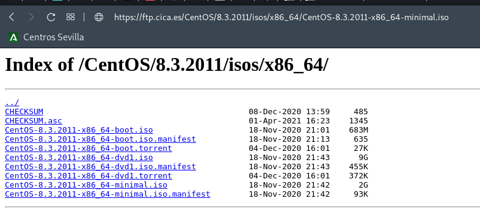

```bash
wget -P $BASEVPS https://ftp.cica.es/CentOS/8.3.2011/isos/x86_64/CentOS-8.3.2011-x86_64-minimal.iso
```
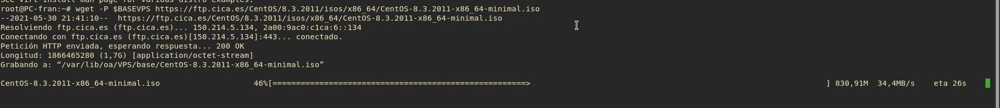

## Comprobar integridad de la Imagen hash

```bash
sha256sum $BASEVPS/CentOS-8.3.2011-x86_64-minimal.iso
```
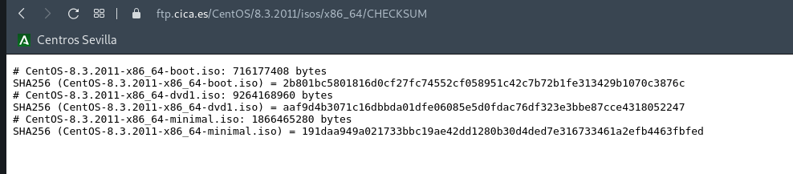
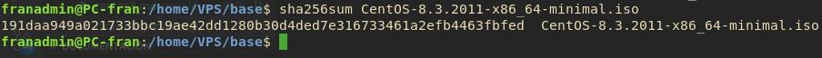

_Los hash son iguales por lo que la integridad de la ISO esta 100% asegurada por SHA-256_

## Crear Máquina

```bash
virt-install --name BaseCentos8 \
--virt-type kvm \
--hvm \
--os-variant=Centos7.0 \
--memory 8096 \
--vcpus 4 \
--network network=default \
--graphics vnc,password=Coria21,listen=0.0.0.0 \
--disk pool=baseVPS,size=25,bus=virtio,format=qcow2 \
--cdrom "$BASEVPS/CentOS-8.3.2011-x86_64-minimal.iso" \
--noautoconsole
```

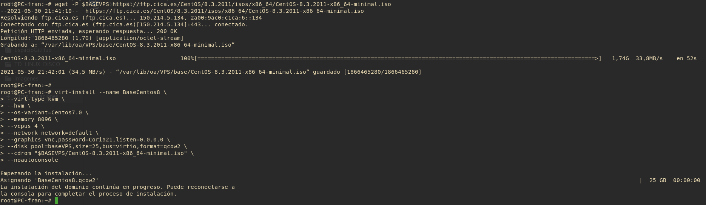
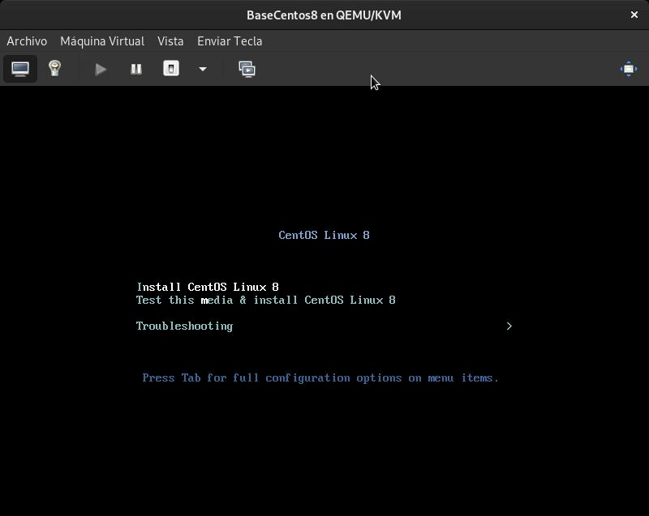
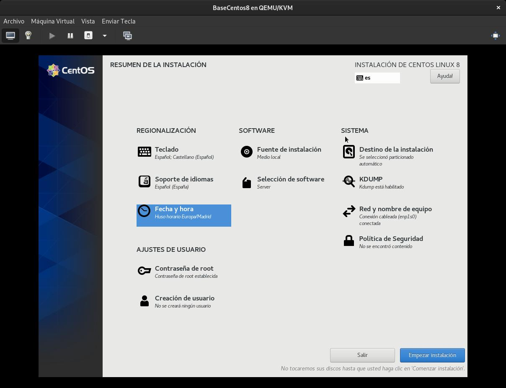
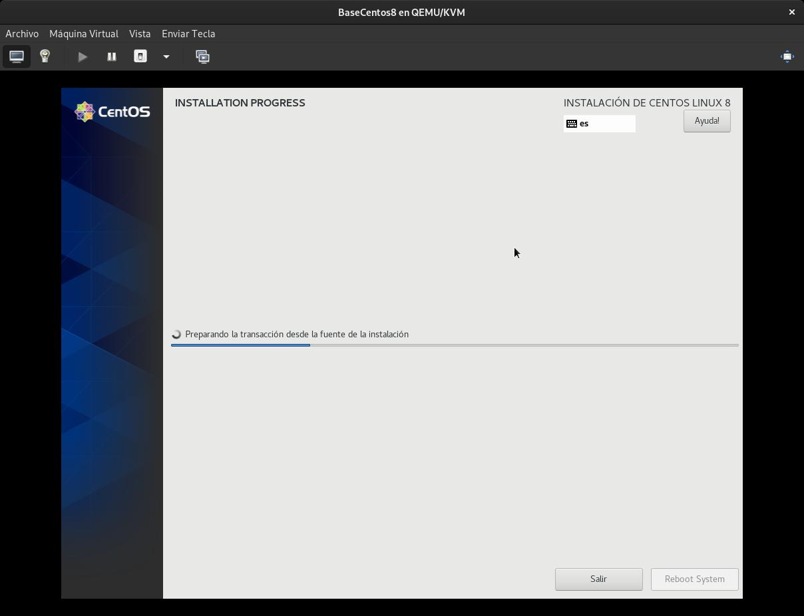
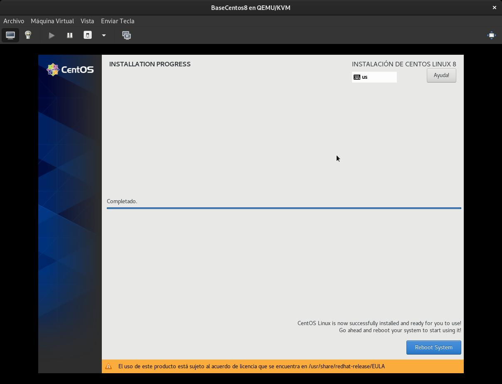
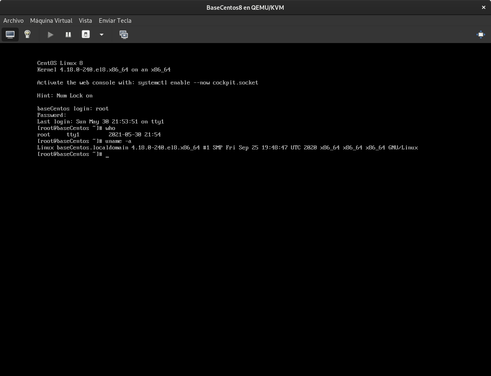

## Instalación SSH Centos

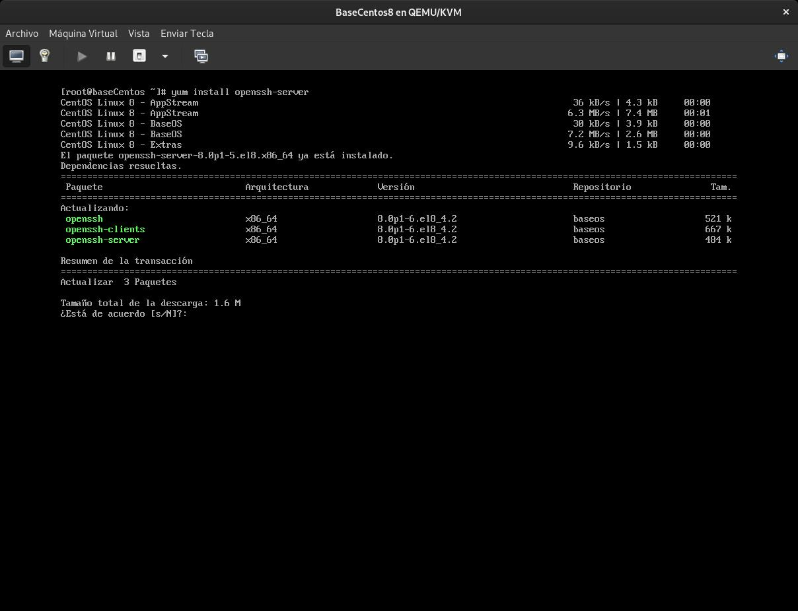
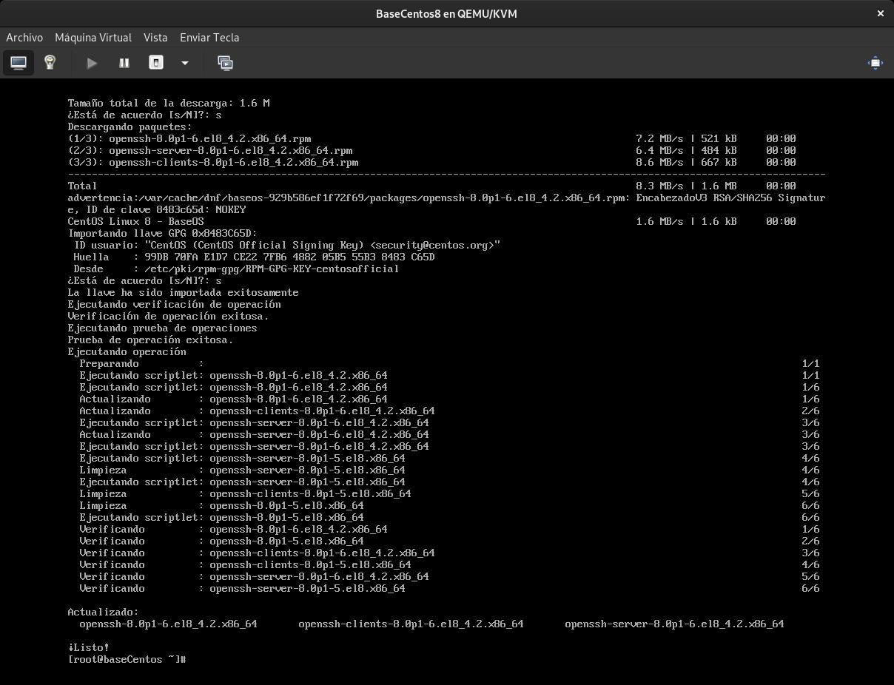

________________________________________
*[Volver al atrás...](./mvBase.md)*


