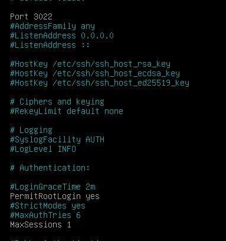
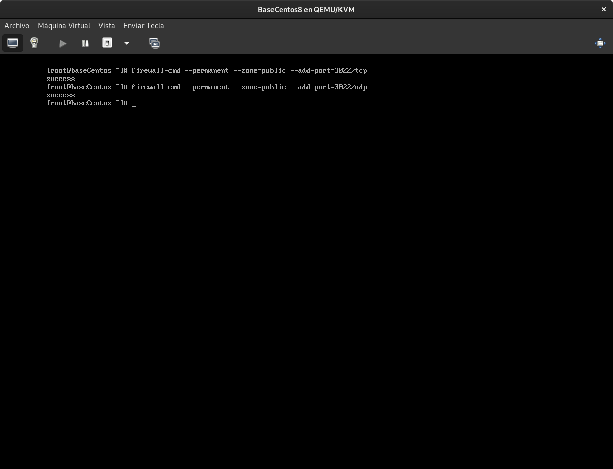

# Configuración General de SSH para Máquinas Linux

El acceso desde la máquina anfitriona a los VPS se configurara directa, sin necesidad de indicar contraseñas. Este acceso se hará via SSH al usuario root por lo que es necesario realizar algunas configuraciones en **`/etc/ssh/sshd_config`**

Para mejorar la seguridad cambiaremos el puerto de conexión SSH y limitaremos el numero de conexiones concurrentes al usuarios `root`.

## En el caso de centos tenemos añadir las exepciones en el firewall

