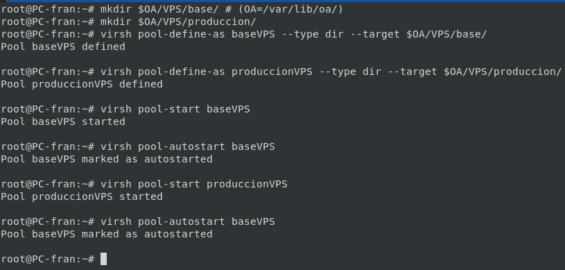
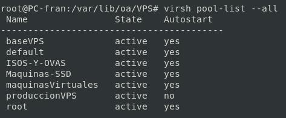
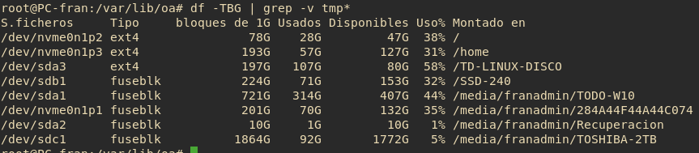
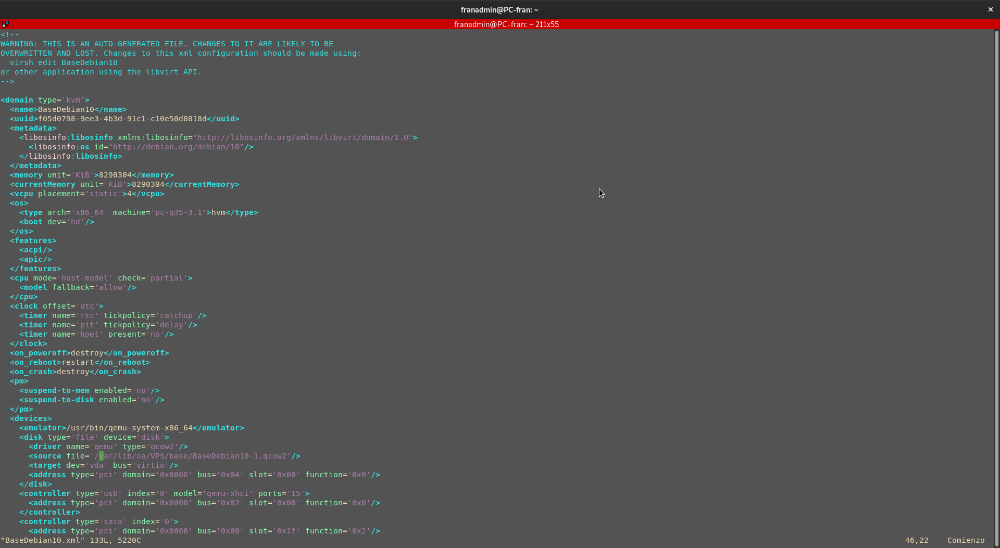

# Pools para los VPS
## Definir Pools.

```bash
mkdir $OA/VPS/base/ # (OA=/var/lib/oa/)
mkdir $OA/VPS/produccion/
virsh pool-define-as baseVPS --type dir --target $OA/VPS/base/
virsh pool-define-as produccionVPS --type dir --target $OA/VPS/produccion/
```

## Activación y Arranque.

```bash
virsh pool-start baseVPS
virsh pool-autostart baseVPS
virsh pool-start produccionVPS 
virsh pool-autostart baseVPS
```


## Ver Pools

```bash
virsh pool-list --all
```



_He tenido que cambiar las rutas de los Pools de las maquinas virtuales por problemas de espacio_

> En mi máquina `/` y `/home` están separados en particiones distintas, siendo `/home` la partición con más espacio disponible por lo que me he visto obligado a cambiar la ruta para evitar posibles problemas de espacio.



Las rutas Originales son: `$OA/VPS/produccion`
Las rutas Originales son: `$OA/VPS/base`

**En mi caso tenía algunas máquinas Base ya creadas por lo que he tenido que cambiarlo directamente en el XML que define las máquinas**

