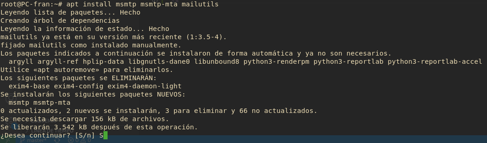
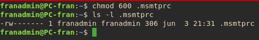
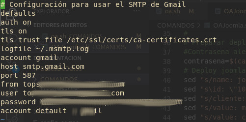

# Configuración de correo

Para enviar correos a los clientes utilizare un acceso directo a GMAIL a través de la bash.

Para ello necesitaremos los paquetes: 
- `msmtp`
-  `msmtp-mta`
-  `mailutils`

```bash
apt install msmtp msmtp-mta mailutils
```



```bash
touch ./msmtprc
chmod 600 ./msmtprc
```



## Configuración del Correo para servidores SMPT de GMAIL

