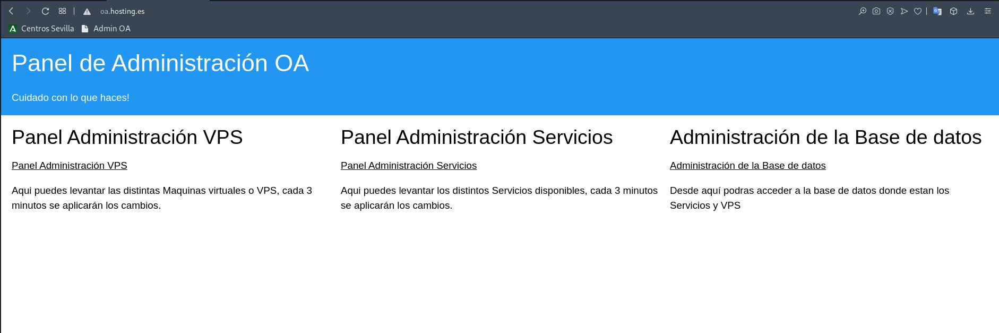

# Panel Administración Web.📖 

## Pagina Principal

La web es puramente HTML y CSS, desde aquí podremos acceder a los distintos paneles de web de administracion de la OA y a phpMyAdmin



```html
<!DOCTYPE html>
<html lang="es">
    <head>
        <meta charset="UTF-8">
        <title>Panel Administración</title>
        <meta name="viewport" content="width=device-width, initial-scale=1">
        <link rel="stylesheet" href="https://www.w3schools.com/w3css/4/w3.css">
    </head>
<body>
    <div class="w3-container w3-blue">
    <h1>Panel de Administración OA</h1> 
    <p>Cuidado con lo que haces!</p> 
    </div>

    <div class="w3-row-padding">
    <div class="w3-third">
        <h2>Panel Administración VPS</h2>
        <a href="http://192.168.0.20/hosting/oaVPS/panelVPS.php">Panel Administración VPS</a>
        <p>Aqui puedes levantar las distintas Maquinas virtuales o VPS,
            cada 3 minutos se aplicarán los cambios.</p>
    </div>

    <div class="w3-third">
        <h2>Panel Administración Servicios</h2>
        <a href="http://192.168.0.20/hosting/oa/panelServicios.php">Panel Administración Servicios</a> 
        <p>Aqui puedes levantar los distintos Servicios disponibles,
            cada 3 minutos se aplicarán los cambios.</p>
        </div>
        
        <div class="w3-third">
            <h2>Administración de la Base de datos</h2>
            <a href="http://192.168.0.20/phpMyAdmin/">Administración de la Base de datos</a> 
        <p>Desde aquí podras acceder a la base de datos donde estan los Servicios y VPS </p>
    </div>
    </div>
</body>
</html>
```

### Panel de Administración de VPS

### Panel de Administración de Servicios

________________________________________
*[Volver al atrás...](./README.md)*