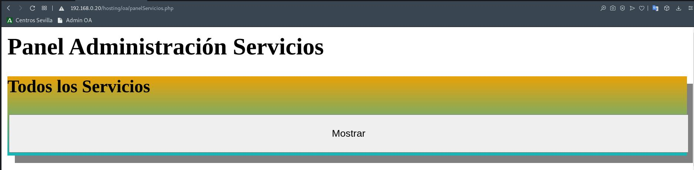
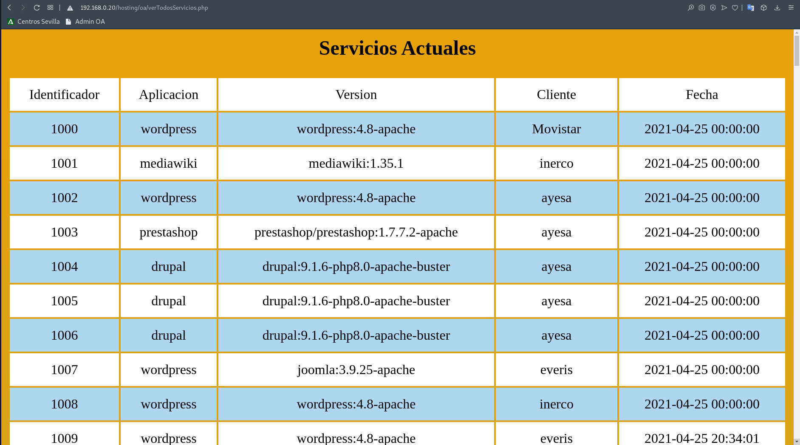
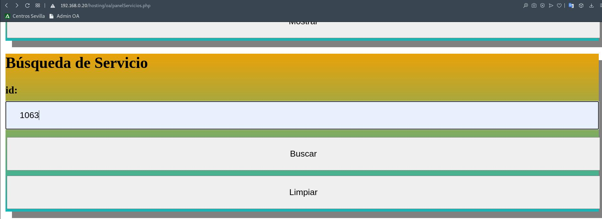
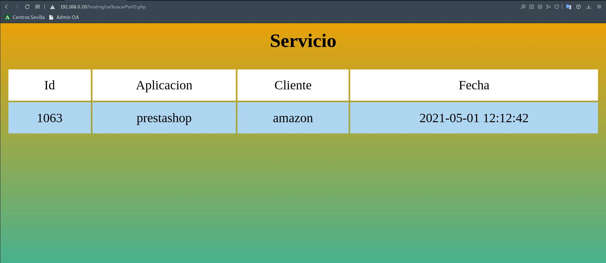
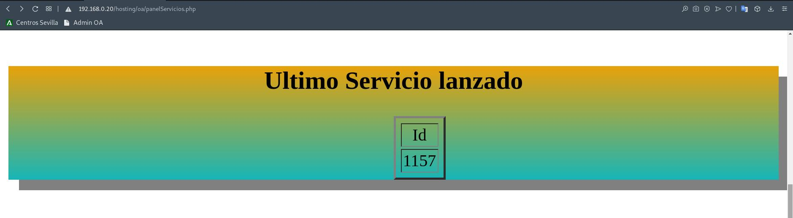
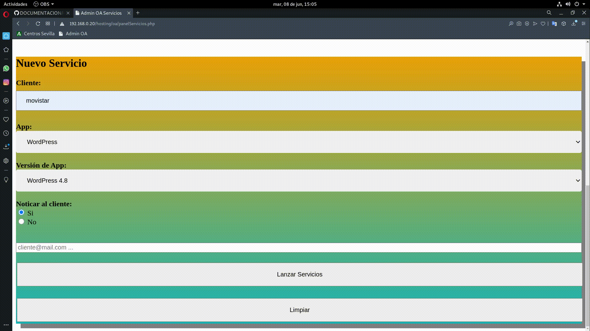

# Panel Administración Web.📖 

## Pagina Principal

La web es puramente HTML y CSS, desde aquí podremos acceder a los distintos paneles de web de administracion de la OA y a phpMyAdmin


```html
<!DOCTYPE html>
<html lang="es">
    <head>
        <meta charset="UTF-8">
        <title>Panel Administración</title>
        <meta name="viewport" content="width=device-width, initial-scale=1">
        <link rel="stylesheet" href="https://www.w3schools.com/w3css/4/w3.css">
    </head>
<body>
    <div class="w3-container w3-blue">
    <h1>Panel de Administración OA</h1> 
    <p>Cuidado con lo que haces!</p> 
    </div>

    <div class="w3-row-padding">
    <div class="w3-third">
        <h2>Panel Administración VPS</h2>
        <a href="http://192.168.0.20/hosting/oaVPS/panelVPS.php">Panel Administración VPS</a>
        <p>Aqui puedes levantar las distintas Maquinas virtuales o VPS,
            cada 3 minutos se aplicarán los cambios.</p>
    </div>

    <div class="w3-third">
        <h2>Panel Administración Servicios</h2>
        <a href="http://192.168.0.20/hosting/oa/panelServicios.php">Panel Administración Servicios</a> 
        <p>Aqui puedes levantar los distintos Servicios disponibles,
            cada 3 minutos se aplicarán los cambios.</p>
        </div>
        
        <div class="w3-third">
            <h2>Administración de la Base de datos</h2>
            <a href="http://192.168.0.20/phpMyAdmin/">Administración de la Base de datos</a> 
        <p>Desde aquí podras acceder a la base de datos donde estan los Servicios y VPS </p>
    </div>
    </div>
</body>
</html>
```

### Panel de Administración de VPS

En el Panel de VPS podremos:

-  Ver los VPS que se encuentran actualmente activos y registrados en la Base de Datos.




-  Buscar por Identificador un VPS que se encuentre activo y registrado en la Base de Datos.




-  Ver el Identificador del ultimo VPS que se encuentra registrado en la Base de Datos.



-  Lanzar una nueva Maquina Virtual o VPS registrandola en la Base de Datos.
    -  Podremos configurar:
        - El nombre del cliente.
        - Numero de Procesadores o vCPUs. (min 1, max 8)
        - Tamaño de la RAM o vRAM. (min 1, max 24)
        - Tamaño de disco Nvme. (min 25, max 100)
        - Sistema Opertivo.
            - Debian 10
            - Ubuntu Server 20.04
            - Centos 8
            - Windows Server 2019
        - Plan del Hosting.
            - Entorno LAMP (Apache, MariaDB, PHP 7.3)
            - Entorno LEMP (Nginx, MariaDB, PHP 7.3)
            - Entorno PostgreSQL 
            - Entorno Desarollo Docker (Entorno Docker opertivo)
        - Acción de Notificar via email al cliente (Envio de Datos de Acceso, credenciales, mensaje de bienvenida, etc).
        - La direccion de correo a la que queremos notificarlo.

Una vez indicada la condiguracion de la maquina y lanzada la OA realizará la consulta SQL y la levantará en KVM-QEMU.

_Ver en el punto de la OA_

### Panel de Administración de Servicios

En el Panel de Servicios podremos:

-  Ver los Servicios que se encuentran actualmente activos y registrados en la Base de Datos.


-  Buscar por Identificador un Servicio que se encuentre activo y registrado en la Base de Datos.


-  Ver el Identificador del ultimo Servicios que se encuentra registrado en la Base de Datos.


-  Lanzar un nuevo Servicios registrandolo en la Base de Datos.
    -  Podremos configurar:
        - El nombre del cliente.
        - App o Servicio.
            - WordPress
            - Joomla
            - PrestaShop
            - MediaWiki _(No disponible automatico)_
            - Drupal
        - Versión de Servicio.
            - WordPress 4.8
            - Joomla 3.9.25
            - PrestaShop 1.7.7.2
            - MediaWiki 1.35.1
            - Druapal 9.1.6
        - Acción de Notificar via email al cliente (Envio de Datos de Acceso, credenciales, mensaje de bienvenida, etc).
        - La direccion de correo a la que queremos notificarlo.



Una vez indicado el Servicio y su versión la OA realizará la consulta SQL y levantará el contenedor de Docker en el Clúster con Kubernetes.

________________________________________
*[Volver al atrás...](./README.md)*